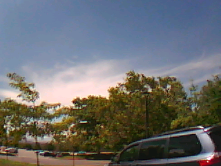
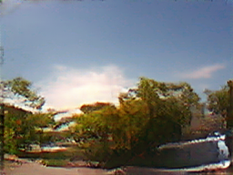
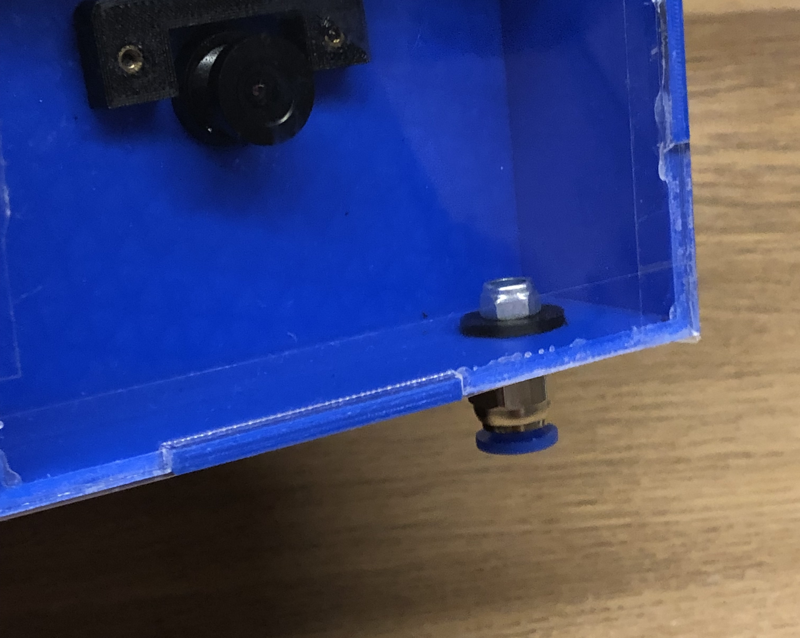
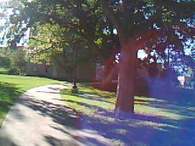

# STEREOFOG - Image-to-image machine translation enables computational defogging in real-world images 
[](https://doi.org/10.1364/OE.532576) | [](https://youtu.be/P8lyz_wZo2c)

In case the Optica link above doesn't work (by clicking on the image), the paper is available here: [GDrive](https://drive.google.com/file/d/1dF6amdbTFjtzVqdbi9FPOLqjNvrFDyOy/view?usp=sharing) | [tubcloud](https://tubcloud.tu-berlin.de/s/xngQjstaPwA2SxL)

The STEREOFOG dataset is available here: [GDrive](https://drive.google.com/drive/folders/1Tzo1lDyHiiTZUwWrtjHaJ5GObJZZZMe1?usp=share_link) | [tubcloud](https://tubcloud.tu-berlin.de/s/eXwHQyfbzkbTdej)

The Supplement 1 PDF is available here: [GDrive](https://drive.google.com/file/d/1fI8xzZ9rzoI0B7fnbTs6-iRzfma490tR/view?usp=sharing) | [tubcloud](https://tubcloud.tu-berlin.de/s/gGcpRqNzdMHgMZa)

## Graphical Abstract
<p align="center">

<figcaption align = "center"><b>Overview of the STEREOFOG project. a): A diagram summarizing the work done in this project. b): Example results obtained by applying the pix2pix framework to the STEREOFOG dataset. Our approach works for a range of fog densities.</b></figcaption>
</p>

## News
**09/04/2024: The paper is now published and available under Open Access.**

**08/20/2024: The paper got accepted into Optics Express!**

---

<p align="center">

</p>

<p align="center">
<font size = "1"> logo image attributions: <a href="https://commons.wikimedia.org/wiki/File:Utah_Utes_-_U_logo.svg">U of U</a> | <a href="https://commons.wikimedia.org/wiki/File:Deutscher_Akademischer_Austauschdienst_logo.svg">DAAD</a></font>
</p>

This repository documents a research project carried out at the [Laboratory for Optical Nanotechnologies](https://nanoptics.wordpress.com) at the University of Utah under supervision of [Prof. Rajesh Menon](https://faculty.utah.edu/u0676529-Rajesh_Menon/research/index.hml) in Summer (July-September) 2023. It was funded as part of the [RISE program](https://www.daad.de/rise/en/) by the [German Academic Exchange Service (Deutscher Akademischer Austauschdienst (DAAD))](https://en.wikipedia.org/wiki/German_Academic_Exchange_Service).

> Disclaimer: This work was supported by a fellowship of the German Academic Exchange Service (DAAD).


 real image  |  foggy image  |   reconstructed image 
:-------------------------:|:-------------------------:|:-------------------------:
 |   | 


## Table of Contents
- [stereofog](#stereofog)
  - [Table of Contents](#table-of-contents)
  - [Goal](#goal)
  - [Potential applications](#potential-applications)
  - [Project timeline](#project-timeline)
  - [Image capturing device](#image-capturing-device)
    - [Requirements](#requirements)
    - [Cameras](#cameras)
    - [Image trigger](#image-trigger)
    - [Wiring \& Programming](#wiring--programming)
    - [Gimbal](#gimbal)
    - [Case](#case)
    - [Bill of Materials (BoM)](#bill-of-materials-bom)
    - [CAD file attributions](#cad-file-attributions)
  - [Model Training](#model-training)
  - [Getting started](#getting-started)
  - [Synthetic data](#synthetic-data)
    - [Foggy Cityscapes from Uni Tübingen](#foggy-cityscapes-from-uni-tübingen)
    - [Foggy Cityscapes from ETH Zürich](#foggy-cityscapes-from-eth-zürich)
    - [Foggy Carla from Uni Tübingen](#foggy-carla-from-uni-tübingen)
  - [Collected dataset](#collected-dataset)
  - [pix2pix on dataset](#pix2pix-on-dataset)
  - [Limitations](#limitations)
  - [Licensing](#licensing)
  - [Citation](#citation)
  - [References](#references)
  - [Appendix](#appendix)


## Goal
This project had three objectives:

1. build a device capable of capturing paired images that depict the same scenery, one image with fog and the other without
2. collect a dataset of paired images
3. apply the [pix2pix model](https://phillipi.github.io/pix2pix/) developed at the University of California, Berkeley to the translation problem **fog &rarr; no fog**

## Potential applications

* Autonomous driving
* Search & rescue (wildfires, home fires, etc.)
* Military

## Project timeline
The project was carried out over the course three months, from July to September 2023. The following Gantt chart shows the project timeline:


<figcaption align = "center"><b>Project timeline</b></figcaption>


## Image capturing device

<details>
<summary><strong>click to expand</strong></summary>

### Requirements

The device had to be able to:
* accomodate two cameras
* isolate the cameras from each other
* provide a fog chamber for one of the cameras
* trigger both cameras at the same time

The shift in perspective hailing from the distance the two cameras are set apart will be ignored. The further away the photographed scenes are, the less this will have an effect on the resulting images.

### Cameras
The two identical cameras used for this project had to be:

* programmable
* able to interface with other devices
* small & lightweight
* low power

Therefore, we chose to use the [OpenMV](https://openmv.io) [H7](https://openmv.io/collections/products/products/openmv-cam-h7) cameras for the task. The [OpenMV IDE](https://openmv.io/pages/download) makes it easy to program the camera using `python`. They are able to receive input from their I/O pins as well as output user feedback using their LEDs.

<p align="center">

<figcaption align = "center"><b>OpenMV H7 camera</b></figcaption>
</p>

### Image trigger
In order to get exactly paired images from both cameras that are captured at the same time, it is necessary to introduce a common trigger. We used a lightweight Arduino board for this task. Any Arduino board should be capable of sending this trigger, but we used an [Adafruit Feather 32u4 Radio](https://learn.adafruit.com/adafruit-feather-32u4-radio-with-rfm69hcw-module) that was available from an earlier project.

<p align="center">

<figcaption align = "center"><b>Adafruit Feather 32u4 Radio board</b></figcaption>

</p>

The board is connected to both cameras and sends a trigger signal to both cameras at the same time. The cameras are programmed to capture an image when they receive the trigger signal.

### Wiring & Programming
<p align="center">

<figcaption align = "center"><b>Schematics for the fog device</b></figcaption>

</p>

**Image Attributions**:
[Switches](https://www.autobotic.com.my/Button-Switch/3-Pin-SPDT-Toggle-Switch-ON-OFF-ON) |
[Breadboard](https://magpi.raspberrypi.com/articles/breadboard-tutorial) |
[Adafruit Feather board](https://learn.adafruit.com/adafruit-feather-32u4-basic-proto/pinouts) |
[OpenMV camera](http://wiki.amperka.ru/_media/products:openmv-cam-h7:openmv-cam-h7-pinout.pdf)

Above is the wiring diagram for the project. Two switches are used to trigger both photos as well as videos. The photo trigger switch is connected to the Arduino board. It detects the state of the pin the switch is connected to and starts the recording loop. This means it sends a trigger signal to the cameras every second, as long as the switch is activated. At the same time, the onboard LED indicates this by blinking:

```arduino
  if (trigger_switch_value == LOW) {
    digitalWrite(LED_BUILTIN, HIGH);
    digitalWrite(TOGGLE_PIN, HIGH);
    delay(650);
    digitalWrite(TOGGLE_PIN, LOW);
    digitalWrite(LED_BUILTIN, LOW);
    delay(650);
  }
```

The total delay of 1.3s was necessary in order to leave the cameras with enough time to process the images. They were equipped with microSD cards with slightly different specifications, and below this threshold, the camera with the slower card would skip an image after a few frames, since it was still processing the previous image.
<p align="center">

<figcaption align = "center"><b>The lower performance microSD card used for one of the cameras</b></figcaption>
</p>

The entire Arduino code can be found in the [Arduino script](arduino/fog_device_trigger.ino).
In addition, the Arduino board is used to pass the 5V power supplied using a USB cable and a powerbank to the cameras.

The video trigger switch is connected directly to the cameras in order to avoid overhead introduced by the Arduino board.

Both OpenMV cameras are equipped with the exact same `python` code that listens to the two pins at which the input signals arrive. In case a video trigger signal is detected, the cameras instantly start recording a video. The video is stopped when the switch returns to the off position. The video is then saved to the microSD card as an `.mjpeg` file, numbered sequentially:

```python
# Loop forever
while(True):

    if mode_pin.value() == 1:

        blue_led.on()

        m = mjpeg.Mjpeg("recorded_videos/"+ str(video_counter) + ".mjpeg")

        while mode_pin.value() == 1:
            clock.tick()
            m.add_frame(sensor.snapshot())
            #print(clock.fps())

        m.close(clock.fps())
        blue_led.off()

        video_counter += 1
```

In case no input signal is detected at the video trigger, the cameras listen to the photo trigger. When a signal is detected there, they capture an image, label it sequentially, save it to the microSD card and then wait for the current trigger signal to go away, as to avoid capturing multiple images on one trigger:

```python
    else:
        # collect image if GPIO pin detects a HIGH signal
        if pin.value() == 1:


                img = sensor.snapshot()

                # toggle green LED after recording image to provide positive user feedback
                green_led.on()
                time.sleep_ms(100)
                green_led.off()

                # Saving the image
                img.save('/recorded_images/' + str(counter))
                counter += 1

                # Stop continuing until the pin value has gone to low again
                while pin.value() == 1:
                    pass # do nothing to wait for the trigger going away, to make sure only one image is collected per trigger
```

The entire `python` code for the cameras can be found in the respective [script](openmv/read_external_trigger.py).

### Gimbal

<p align="center">

<figcaption align = "center"><b>Gimbal model used in this project</b></figcaption>
</p>

In order to stabilize the images while walking and ensure they are approximately level, a gimbal was used to hold the entire device. The gimbal used for this project was the [Hohem iSteady Q](https://store.hohem.com/products/isteady-q). It is a lightweight single-axis gimbal that is able to hold a smartphone.

### Case

In order to be able to capture approximately the same image, the cameras had to be mounted as close together as possible. Simultaneously, the case must be able to hold the fog surrounding one camera while isolating the other camera from the influence of the fog, keeping all other conditions the same.

Therefore, both cameras are arranged side by side, inside separate chambers. The setup of the initial prototype put the box with the two cameras far above axis of rotation of the gimbal. The resulting torque to keep the construction level was too high in this configuration, causing the gimbal to shut off regularly.

<p align="center">

<figcaption align = "center"><b>The gimbal failing to keep the first prototype level</b></figcaption>
</p>


The case was designed in [Fusion 360](https://www.autodesk.com/products/fusion-360/overview). Some 3D printed files were printed using a [Creality Ender 3 Pro](https://www.creality3dofficial.com/products/ender-3-pro-3d-printer), some on an [Ultimaker S3](https://ultimaker.com/3d-printers/ultimaker-s3). The front plate was lasercut on a CO<sub>2</sub> laser cutter.

<p align="center">

<figcaption align = "center"><b>CAD design of the gimbal mount</b></figcaption>
</p>
<p align="center">

<figcaption align = "center"><b>CAD design of the gimbal bridge</b></figcaption>

</p>
<p align="center">

<figcaption align = "center"><b>Front view of entire CAD design</b></figcaption>
</p>

<p align="center">

<figcaption align = "center"><b>Rear view of entire CAD design</b></figcaption>
</p>

### Handheld fogger
Initially, the following small handheld fogger was used:

<p align="center">

<figcaption align = "center"><b>The old handheld fog machine</b></figcaption>
</p>

For filling the device's fog chamber, its nozzle was inserted into the opening at the bottom of the chamber, while allowing air to escape through the opening at the top, inside the maintenance door. Since there was no perfect seal between the nozzle and the chamber, refilling took longer than necessary.

In the updated prototype, a new fogger with a plastic tube was used. This was directly ported into the chamber through a pneumatic fitting. This allowed for nearly lossless filling of the fog chamber.


<p align="center">

<figcaption align = "center"><b>The new handheld fog machine</b></figcaption>
</p>

 CAD design  |  physical prototype 
:-------------------------:|:-------------------------:
 |  


### Bill of Materials (BoM)
The following components are required for the device:

#### Purchased Parts
- 2x [OpenMV H7 camera](https://openmv.io/collections/products/products/openmv-cam-h7)
- 1x [Adafruit Feather board](https://www.adafruit.com/product/3458) (or any other microcontroller capable of this task, i.e., any other microcontroller)
- 1x [Hohem iSteady Q](https://store.hohem.com/products/isteady-q) gimbal
- 2x Toggle switch (any latching switch that can be used to trigger the cameras)
- 1x Breadboard 30x70mm
- 2x Rubber stoppers

#### Manufactured parts
- Back box
- Front plate
- Front camera screw terminal
- Gimbal mount
- Gimbal bridge
- Hinge
- Lock body
- Lock catch
- Lock receptor
- Maintenance door with hinge
- Maintenance door brace
- Rear camera standoff
- Top plate
- Wire restraint

### CAD file attributions

Several parts of the CAD model were adopted from different sources. They are attributed in the following:

<p align="center">

Part | Source | License
--- | --- | ---
OpenMV camera | [GrabCAD](https://grabcad.com/library/openmv-cam-h7-1/details?folder_id=7042713) | [unknown](https://en.wikipedia.org/wiki/Rick_Astley)
Adafruit Feather board | [Adafruit](https://github.com/adafruit/Adafruit_CAD_Parts/blob/main/2795%20Feather%2032u4%20Adalogger/2795%20Feather%2032u4%20Adalogger.step) | [MIT](https://opensource.org/license/mit/)
Prototyping board | [GrabCAD](https://grabcad.com/library/universal_board_30x70mm-1) | [unknown](https://en.wikipedia.org/wiki/Rick_Astley)
Toggle switch | [GrabCAD](https://grabcad.com/library/toggle-switch-37) | [unknown](https://en.wikipedia.org/wiki/Rick_Astley)
DIN912 M3 25mm screw | [3Dfindit](https://www.3dfindit.com/en/digitaltwin/hexagon-socket-head-cap-screws?path=fabory%2F2_socket_products_and_set_screws%2Fdin_912.prj&mident=%7Bfabory%2F2_socket_products_and_set_screws%2Fdin_912.prj%7D%2C016+%7BLINEID%3D50640%7D++%7BNB%3DZylinderschraube+DIN+912+M2x25+55050.020.025%28High%29%7D%2C%7BCNSORDERNO%3D55050.020.025%7D%2C%7BNENNID%3DM2X25%7D%2C%7BD%3D2.0%7D%2C%7BL%3D25.0%7D%2C%7BBRAND%3DFabory%7D%2C%7BSTANDARD%3DDIN+912%7D%2C%7BTHREAD%3DMetric+thread%7D%2C%7BTHREADDIRECTIO%3DRight%7D%2C%7BSTYLE%3D%7D%2C%7BTYPE%3DSocket+cap+screw%7D%2C%7BBASICMATERIAL%3DStainless+steel%7D%2C%7BGRADE%3DA4-70%7D%2C%7BSURFACETREATME%3D%7D%2C%7BHEADSHAPE%3DCylindrical+head%7D%2C%7BDRIVINGFFEATURE%3DHexagon+socket%7D%2C%7BCOLOR%3D%7D%2C%7BCOMPARABLESTAN%3DISO4762%2CASMEB18.3.1M%2CBS4168-1%2CNEN1241%2CNFE25-125%7D%2C%7BADDITIONALINFO%3D%7D%2C%7BROHS%3DY%7D%2C%7BAPPROVAL%3D%7D%2C%7BEANCODE%3D8715494620321%7D%2C%7BINTRASTATCODE%3D73181562%7D%2C%7BECLASS%3D23-11-06-27%7D%2C%7BUNSPSC%3D31161605%7D%2C%7BETIM%3DEC002356%7D%2C%7BPACKAGING%3D500%7D%2C%7BTL%3D0.000%7D%2C%7BVARIANT%3D1%7D%2C%7BFAB_NENN%3DM2x25%7D%2C%7BFAB_GEO%3Db%3D16%3Bd%3DM2%3Bdk+%28max.%29%3D3.8%3BFull+thread+L+%3F%3D20%3Bk+%28max.%29%3D2%3BLength+%28L%29%3D25%3BP%3D0.4%3Bs%3D1.5%7D%2C%7BFAB_ARTICLENUMBER%3D%7D%2C%7BFABNETWEIGHT%3D0.001%7D%2C%7BGEWINDE%3D0%7D%2C%7BP%3D0.400%7D%2C%7BBX%3D16.000%7D%2C%7BDK%3D3.800%7D%2C%7BDA%3D2.600%7D%2C%7BDS%3D2.000%7D%2C%7BE%3D1.730%7D%2C%7BF%3D0.510%7D%2C%7BK%3D2.000%7D%2C%7BR%3D0.100%7D%2C%7BS%3D1.500%7D%2C%7BT%3D1.000%7D%2C%7BV%3D0.200%7D%2C%7BDW%3D3.480%7D%2C%7BW%3D0.550%7D%2C%7BCNSAVOID%3D0%7D%2C%7BLOD%3DHigh%7D%2C%7BSTANDARDSMALL%3Ddin_912.png%7D) | [unknown](https://en.wikipedia.org/wiki/Rick_Astley)
</p>

</details>

## Model Training

The models were either trained on a lab computer equipped with a dedicated GPU (NVIDIA GeForce GTX 970) and 64 GB of RAM or on the University of Utah's [Center for High Performance Computing (CHPC)](https://www.chpc.utah.edu) cluster.
All models were trained for the default 200 epochs for the pix2pix model. The training time increased along with the size of the dataset. For the final model, the training time was around 20 hours.

## Getting started
*descriptions on how to get up and running*

<details>
<summary><strong>click to expand</strong></summary>


### 1. Cloning the repository

Clone the repository using `git`:
```bash
git clone https://github.com/apoll2000/stereofog.git
```

Navigate into the repository:
```bash
cd stereofog
```

### 2. Installing a Python environment

Next, an appropriate Python environment needs to be created. All code was run on Python `3.9.7`. For creating the environment, either [`conda`](https://www.anaconda.com) or [`pyenv virtualenv`](https://github.com/pyenv/pyenv-virtualenv) can be used.

---
The environment can be created using `conda` with:
```bash
conda create --name stereofog python=3.9.7
```

Or using `pyenv virtualenv` with:
```bash
pyenv virtualenv 3.9.7 stereofog
```
---
Then activate the environment with:
```bash
conda activate stereofog
```
Or:
```bash
pyenv activate stereofog
```

---
Using `pip`, the required packages can then be installed. (for `conda` environments, execute
```bash
conda install pip
```
before to install pip). The packages are listed in the `requirements.txt` and can be installed with:
```bash
pip install -r requirements.txt
```

In case you want to install them manually, the packages include:

- `numpy`
- `torch`
- `opencv-python`
- `matplotlib`
- ...

It is important that you specify the right `torch` version if you would like to use your CUDA-enabled GPU to train the model, which will drastically reduce training time. See the [PyTorch website](https://pytorch.org/get-started/locally/) for more information.

### 3. Downloading the dataset

The dataset is currently being hosted here:
[TUBCloud](https://tubcloud.tu-berlin.de/s/TWW4ABJSarpZ7Mc). Depending on the further development of the project, this might not be the final storing location.

Place the `stereofog_images` folder into the `datasets` folder of the repository:

```bash
-- datasets
    |-- stereofog_images
        |-- 2023-08-03-04
            |-- A
                |-- 01-04_08_23__1.bmp
                |-- 01-04_08_23__2.bmp
                |-- ...
            |-- B
                |-- 01-04_08_23__1.bmp
                |-- 01-04_08_23__2.bmp
                |-- ...
        |-- ...
```

### 4. Preparing the dataset

The dataset needs to be prepared for training. This includes transforming the folder structure into one compatible with the pix2pix framework and splitting the dataset into training, validation and testing sets. It can be performed using the following command:
```bash
python preprocess_stereofog_dataset.py --dataroot path/to/dataset
```

### 5. Training a model

The model training can be started using the following command:
```bash
python train.py --dataroot path/to/dataset --name name_of_model --model pix2pix --direction BtoA --gpu_ids 0
```

### 6. Testing a model

```bash
python test.py --dataroot path/to/dataset --direction BtoA --model pix2pix --name name_of_model
```

Ample information on the training and testing process and their parameters can be found on the [pix2pix GitHub page](https://github.com/junyanz/pytorch-CycleGAN-and-pix2pix/tree/master).

</details>

### 7. Helper scripts
This GitHub page includes several helper scripts to perform different actions like hyperparameter tuning or epoch visualization.

These are:

Preprocessing:
- `preprocess_stereofog_dataset.py`
- 
Hyperparameter tuning:
- `hyperparameter_dropoutRate.py`
- `hyperparameter_GAN.py`
- `hyperparameter_init_type.py`
- `hyperparameter_lr_policy.py`
- `hyperparameter_n_layers_D.py`
- `hyperparameter_netD.py`
- `hyperparameter_netG.py`
- `hyperparameter_ngf_ndf.py`
- `hyperparameter_normalization.py`
- `hyperparameter_Res9AndMore.py`
- `hyperparameter_supertraining.py`
- 
Visualization:
- `plot_model_results.py`
- `evaluate_model_group.py`

## Synthetic data

<details>
<summary><strong>click to expand</strong></summary>

At the beginning of the project, we experimented with synthetic datasets in combination with the pix2pix model. The datasets used were based on the [Cityscapes dataset](https://www.cityscapes-dataset.com/) as well as on images derived from the [CARLA simulator](https://carla.org/).
The fog simulations generally work either by directly using a depth map that is available for each particular image, or by using the left and right images to calculate the depths in the images, thus reconstructing this depth map. This depth map helps in estimating how strongly the fog affects different parts of the image.

### Semi-synthetic datasets
The datasets in the following are semi-synthetic, meaning that they work with real images, to which the fog has been added synthetically. A disadvantage of this method is that the depth map is never perfect, which can lead to artifacts in the fogged images.

#### Foggy Cityscapes from Uni Tübingen
In cooperation with the researchers [Georg Volk](https://www.embedded.uni-tuebingen.de/en/team/georg-volk/) and [Jörg Gamerdinger](https://embedded.uni-tuebingen.de/en/team/joerg-gamerdinger/) from the University of Tübingen, Germany, we trained a model on synthetic data generated for their paper ["Simulating Photo-realistic Snow and Fog on Existing Images for Enhanced CNN Training and Evaluation"](https://embedded.uni-tuebingen.de/assets/publications/vonBernuth-Volk-Bringmann_Snow_Fog.pdf).

#### Foggy Cityscapes from ETH Zürich
Another dataset taken into consideration was the [Foggy Cityscapes dataset](http://people.ee.ethz.ch/~csakarid/SFSU_synthetic/) from the paper ["Semantic Foggy Scene Understanding with Synthetic Data"](http://people.ee.ethz.ch/~csakarid/SFSU_synthetic/Semantic_foggy_scene_understanding_with_synthetic_data-Sakaridis+Dai+Van_Gool-IJCV-AAM.pdf) by [Sakaridis et al.](https://people.ee.ethz.ch/~csakarid/). The dataset was created by the [Computer Vision Lab](https://www.vision.ee.ethz.ch/en/) of ETH Zürich, Switzerland.

### Fully synthetic datasets
The following dataset was created entirely synthetically. The original images were rendered using a driving simulator, which generated the matching perfect depth maps as well. This way, the fogged images do not show any artifacts.

#### Foggy CARLA from Uni Tübingen
This dataset was created by the researchers [Georg Volk](https://www.embedded.uni-tuebingen.de/en/team/georg-volk/) and [Jörg Gamerdinger](https://embedded.uni-tuebingen.de/en/team/joerg-gamerdinger/) from the University of Tübingen, Germany, using the same technique from the paper ["Simulating Photo-realistic Snow and Fog on Existing Images for Enhanced CNN Training and Evaluation"](https://embedded.uni-tuebingen.de/assets/publications/vonBernuth-Volk-Bringmann_Snow_Fog.pdf). It is based on the [CARLA simulator](https://carla.org/).

</details>

## Collected dataset

Please refer to the description of the dataset in section 2 (Experiments) of the paper.
## Results

Please refer to the description of the results in section 3 (Results) of the paper.

## Limitations
### Overexposure

Looking through the images in the dataset, you will notice that it was mostly avoided to face the cameras directly at the sun (which was shining almost every day in the [hot and dry summer of Salt Lake City](https://en.wikipedia.org/wiki/Climate_of_Salt_Lake_City)). This was due to a limitation of the [OpenMV H7 cameras](https://openmv.io/products/openmv-cam-h7) used to capture the images. Their dynamic range is limited and they tend to be unable to resolve the high dynamic range when facing the sun directly.

<p align="center">

original | fogged
:-------------------------:|:-------------------------:
 | 
</p>

The cameras were used in spite of this issue because of their advantages in programmability, connectivity and compactness.

### Weather conditions

As just mentioned, the images show almost exclusively sunny scenes. This is due to them being mostly collected during August, which is the clearest month of the year in Salt Lake City, with [the sky being clear around 78% of the time](https://weatherspark.com/y/2706/Average-Weather-in-Salt-Lake-City-Utah-United-States-Year-Round). The few times it was raining, the camera was not used to avoid damage to the electronics.


# Licensing

## Code
The code is licensed under the [BSD 3-Clause License](https://opensource.org/licenses/BSD-3-Clause), available under [CODE_LICENSE](CODE_LICENSE.txt).
-> this is taken from pyramid pix2pix

The parts of the code that were adopted from the pix2pix project are licensed under ... MAKE SURE NOT TO VIOLATE PIX2PIX BSD LICENSE HERE

## Dataset
The dataset is licensed under the [Creative Commons Attribution 4.0 International License](https://creativecommons.org/licenses/by/4.0/), available under [DATASET_LICENSE](DATASET_LICENSE.txt).

-> or should this be CC-BY-NC (non-commercial?)

## Hardware
The hardware is licensed under the [CERN Open HArdware License v2 - Weakly Reciprocal (CERN-OHL-W v2)](https://ohwr.org/project/cernohl/wikis/Documents/CERN-OHL-version-2), available under [HARDWARE_LICENSE](HARDWARE_LICENSE.txt).

# Citation

If you use the dataset or any of the code in this repository created by us, please cite the following paper:

```
@misc{pollak2023stereofog,
      title={STEREOFOG -- Computational DeFogging via Image-to-Image Translation on a real-world Dataset}, 
      author={Anton Pollak and Rajesh Menon},
      year={2023},
      eprint={2312.02344},
      archivePrefix={arXiv},
      primaryClass={cs.CV}
}
```

# References

* [1]:


# Appendix

<details>
<summary><strong>click to expand</strong></summary>

## Fog Decay Study

We conducted a study on how quickly the fog decays in order to know better how often it needs to be replenished. This was done by filling the fog chamber, letting the fog decay and filming the entire decay using both of the cameras. The resulting video of the fogged camera was analyzed by calculating the [Variance of the Laplacian](https://pyimagesearch.com/2015/09/07/blur-detection-with-opencv/) of each frame as a metric for the intensity of the fog. You can see that after about 5 minutes, the fog intensity becomes quite low.

<p align="center">

<figcaption align = "center"><b>Fog decay measurement over time</b></figcaption>
</p>

</details>
